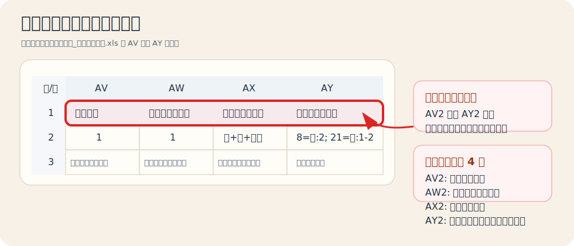
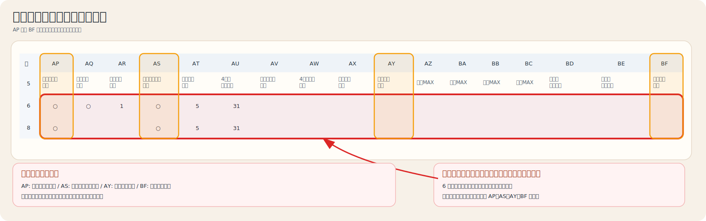

# 【統一書式】あかねっこ_設定項目追加.xls 説明書

## この説明書で分かること

- どのセルに何を書くのか
- 空欄にしたときにどうなるのか
- よく使う設定の書き方
- 難しい項目をどう考えればよいか

この勤務表は、右端の設定欄に書いた内容を読み取って、自動作成に使います。

難しく考えなくて大丈夫です。まずは次の考え方だけ覚えれば十分です。

- 空欄なら、今までの設定をそのまま使います
- ○ を入れる項目は「この人を対象にする」という意味です
- 数字を入れる項目は「上限」や「回数」です
- 分からない項目は空欄のままでかまいません

## 最初に覚える 3 つ

### 1. 月全体の設定は上の AV2 から AY2

- AV2: 夜勤回数をどれくらい揃えるか
- AW2: 土日休み回数をどれくらい揃えるか
- AX2: 土日休みに何を含めるか
- AY2: 特定の日だけ人数を増やしたいときの指定

### 2. 職員ごとの設定は右端の AP 列から BF 列

各職員の行に、その人だけの条件を書きます。

### 3. 空欄は「変更しない」

迷ったら空欄で大丈夫です。書いた項目だけ上書きされます。

## 実際の画面イメージ

実ファイル [【統一書式】あかねっこ_設定項目追加.xls](../../%E3%80%90%E7%B5%B1%E4%B8%80%E6%9B%B8%E5%BC%8F%E3%80%91%E3%81%82%E3%81%8B%E3%81%AD%E3%81%A3%E3%81%93_%E8%A8%AD%E5%AE%9A%E9%A0%85%E7%9B%AE%E8%BF%BD%E5%8A%A0.xls) の設定欄を、見やすい表にしたものです。

### 月全体の設定の場所



| 行/列 | AV | AW | AX | AY |
| --- | --- | --- | --- | --- |
| 1 | 月次設定 | 土日休公平化差 | 休日数カウント | 指定日人数条件 |
| 2 | 1 | 1 | 休+特+夜休 | 8=日:2; 21=日:1-2 |
| 3 | 夜勤公平化許容差 | 土日休公平化許容差 | 土日休カウント方式 | 夜休連鎖定義 |

見方:

- 2 行目が実際に入力する値です
- 3 行目は説明文です
- AY2 は今のファイルでは `8=日:2; 21=日:1-2` が入っています

### 個人ごとの設定の場所



| 行/列 | AP | AQ | AR | AS | AT | AU | AV | AW | AX | AY | AZ | BA | BB | BC | BD | BE | BF |
| --- | --- | --- | --- | --- | --- | --- | --- | --- | --- | --- | --- | --- | --- | --- | --- | --- | --- |
| 5 | 夜勤公平化対象 | 夜夜必須対象 | 夜夜必須回数 | 土日休公平化対象 | 個別連勤上限 | 4連勤許容回数 | 早遅平準化対象 | 4連勤配慮対象 | 日勤候補対象 | 休系回数指定 | 早番MAX | 日勤MAX | 遅番MAX | 夜勤MAX | 曜日別勤務制限 | 日付別勤務制限 | 勤務可能一覧 |
| 6 | ○ | ○ | 1 | ○ | 5 | 31 |  |  |  |  |  |  |  |  |  |  |  |
| 7 |  |  |  |  |  |  |  |  |  |  |  |  |  |  |  |  |  |
| 8 | ○ |  |  | ○ | 5 | 31 |  |  |  |  |  |  |  |  |  |  |  |

見方:

- 5 行目が項目名です
- 6 行目以降に、各職員の条件を書きます
- `○` が入っている項目だけ、その人を対象にします
- 数字が入っている項目だけ、その人専用の回数や上限として使います

## まずはここだけ使えば十分

最初は次の 4 つだけ使うのがおすすめです。

1. AP 夜勤公平化対象
2. AS 土日休公平化対象
3. AY 休系回数指定
4. BF 勤務可能一覧

これだけでも、かなり調整しやすくなります。

## 月全体の設定

月全体の設定は、勤務表の上の方にあります。

| セル | 項目 | 何を書くか | 迷ったときのおすすめ |
| --- | --- | --- | --- |
| AV2 | 夜勤公平化許容差 | 整数 | 1 |
| AW2 | 土日休公平化許容差 | 整数 | 1 |
| AX2 | 土日休カウント方式 | `休のみ` / `休+夜休` / `休+特+夜休` | `休+特+夜休` |
| AY2 | 日別人数指定 | 例: `8=日:2; 21=日:1-2` | 空欄 |

### AV2 夜勤公平化許容差

夜勤回数の差をどこまで許すかです。

- `1` なら、対象者どうしの夜勤回数差は 1 回までに近づけます
- 数字が小さいほど、できるだけ平等にします
- 空欄なら既定値を使います

例:

```text
1
```

### AW2 土日休公平化許容差

土日休み回数の差をどこまで許すかです。

- `1` なら、対象者どうしの差を 1 回までに近づけます
- 空欄なら既定値を使います

例:

```text
1
```

### AX2 土日休カウント方式

「土日休み」として何を数えるかを決めます。

- `休のみ`: 通常の休みだけ数える
- `休+夜休`: 通常の休みと夜勤明け休みを数える
- `休+特+夜休`: 通常の休み、特休、夜勤明け休みを数える

迷ったら次を使ってください。

```text
休+特+夜休
```

### AY2 日別人数指定

イベント日や行事日などで、その日だけ人数を厚くしたいときに使います。

書き方:

- `日付=勤務:人数`
- 幅を持たせるなら `日付=勤務:1-2`
- 同じ日に複数指定するなら `,` でつなぐ
- 複数の日を指定するなら `;` で区切る

例:

```text
8=日:2; 21=日:1-2
```

意味:

- 8日は日勤を 2 人にする
- 21日は日勤を 1 人から 2 人にする

空欄なら、その月だけの特別人数指定は無しです。

## 職員ごとの設定

職員ごとの設定は、その人の行の右端に書きます。

### ○ / × で入れる項目

次の項目は、基本的に `○` を入れた人だけ対象になります。

| 列 | 項目 | 意味 |
| --- | --- | --- |
| AP | 夜勤公平化対象 | この人を夜勤回数の平等化の対象にする |
| AQ | 夜夜必須対象 | この人に「夜夜」を入れる対象にする |
| AS | 土日休公平化対象 | この人を土日休み平等化の対象にする |
| AV | 早遅平準化対象 | 同じユニット内で早番・遅番の偏りを抑える対象にする |
| AW | 4連勤配慮対象 | 4連勤をなるべく少なくしたい対象にする |
| AX | 日勤候補対象 | 通常の日勤を入れられる人として扱う |

入力ルール:

- `○` または `1` で有効
- `×` または空欄で無効

例:

```text
○
```

### 数字を入れる項目

| 列 | 項目 | 意味 |
| --- | --- | --- |
| AR | 夜夜必須回数 | 「夜夜」を最低何回入れたいか |
| AT | 個別連勤上限 | この人だけ連勤の上限を変える |
| AU | 4連勤許容回数 | 4連勤を何回まで許すか |
| AY | 休系回数指定 | 休・特・夜休を合計で何回にするか |
| AZ | 早番MAX | 早番の上限回数 |
| BA | 日勤MAX | 日勤の上限回数 |
| BB | 遅番MAX | 遅番の上限回数 |
| BC | 夜勤MAX | 夜勤の上限回数 |

入力ルール:

- 半角でも全角でもなく、普通の数字で入力
- 小数ではなく整数
- 空欄ならその項目は変更しません

例:

```text
5
```

### AR 夜夜必須回数

AQ を `○` にした人に対して、最低何回「夜夜」を入れたいかを書きます。

例:

```text
1
```

### AT 個別連勤上限

その人だけ、最大何連勤までにするかを書きます。

例:

```text
4
```

意味:

- この人は 4 連勤まで

### AU 4連勤許容回数

4連勤が何回までならよいかを書きます。

例:

```text
1
```

意味:

- 4連勤は 1 回までにしたい

### AY 休系回数指定

その人の休み回数を固定したいときに使います。

ここで数えるのは、次の合計です。

- `休`
- `特`
- `夜休`

例:

```text
10
```

意味:

- その人の休系回数を合計 10 回にする

## 勤務の種類を直接しぼる項目

### BF 勤務可能一覧

その人がその月に入ってよい勤務を並べます。

書き方:

- 勤務記号を `/` で区切る
- `,` や空白で区切っても読めます
- 空欄なら、もともとの設定を使います

例:

```text
早/遅/日/休
```

意味:

- 早番、遅番、日勤、休みは入る
- 夜勤は入らない

使える記号の例:

- `早`
- `遅`
- `日`
- `夜`
- `夜休`
- `休`
- `特`
- `空欄`
- 非常勤で使う `3.0` `5.5` `6.0`

補足:

- `夜` を入れると、夜勤明けの `夜休` は自動で扱われます
- 「空欄勤務」を許したいときは、文字で `空欄` と書けます

## 曜日や日付でしばる項目

### BD 曜日別勤務制限

曜日ごとに、その日に入ってよい勤務だけを書けます。

書き方:

- `曜日=勤務/勤務`
- 複数の曜日は `;` で区切る

例:

```text
金=早/遅/日/夜/休; 土=早/遅/日/夜/休; 日=早/遅/日/夜/休
```

もっと簡単な例:

```text
月=早/日/休; 火=早/日/休; 水=早/日/休; 木=早/日/休
```

意味:

- 月火水木は、早番・日勤・休みだけにする

使える曜日:

- `月` `火` `水` `木` `金` `土` `日`

### BE 日付別勤務制限

特定の日だけ、その日に入ってよい勤務を指定できます。

書き方:

- `日付=勤務/勤務`
- 複数の日は `;` で区切る

例:

```text
5=休; 17=休; 21=早/日
```

意味:

- 5日は休みだけ
- 17日も休みだけ
- 21日は早番か日勤だけ

## 指定勤務日について

右端の設定列とは別に、日ごとの勤務マスへ直接 `早` や `休` を入れた場合は、その内容が指定勤務として優先されます。

例:

- 研修の日はその日のマスに `日` を入れる
- 委員会の日はその日のマスに `早` を入れる
- 必ず休みにしたい日はその日のマスに `休` を入れる

委員会日は、今の運用では「その日を早番の指定勤務にする」と考えてください。

## よくある設定例

### 例1 夜勤に入れたくない

BF に次を書きます。

```text
早/遅/日/休
```

### 例2 この人だけ休みを 10 回にしたい

AY に次を書きます。

```text
10
```

### 例3 土日休みの回数を平等にしたい

対象にしたい人の AS に `○` を入れます。

月全体の AW2 は次がおすすめです。

```text
1
```

### 例4 8日は日勤を 2 人にしたい

AY2 に次を書きます。

```text
8=日:2
```

### 例5 5日だけ休みにしたい

BE に次を書きます。

```text
5=休
```

## 分からないときの優先順位

迷ったら次の順で考えてください。

1. まず空欄のまま使う
2. BF の勤務可能一覧だけ入れる
3. 必要な人だけ AP や AS に ○ を入れる
4. それでも足りなければ AY や MAX 列を入れる
5. 最後に BD や BE の細かい制限を使う

## 入力で気をつけること

- ○ / × は見た目が似ていても、できれば同じ書き方で統一する
- 数字は整数だけにする
- `;` と `/` は半角でそろえると安全
- 勤務記号は、実際に勤務表で使っている記号と合わせる
- BF や BD、BE は、最初は他の人の例をコピーして書き換えるのが安全

## おすすめの使い方

最初の 1 か月は、次の使い方がおすすめです。

1. 月全体は AV2=1、AW2=1、AX2=休+特+夜休 のまま使う
2. 必要な人だけ AP、AS、AY、BF を埋める
3. 行事日がある月だけ AY2 を入れる
4. 出来上がったあとに validation HTML を見て、必要なら追加で直す

これなら、難しい設定を全部覚えなくても使い始められます。